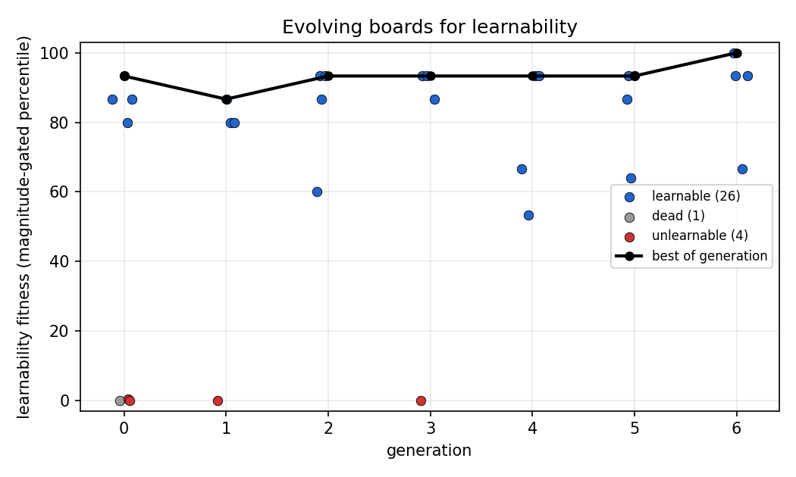
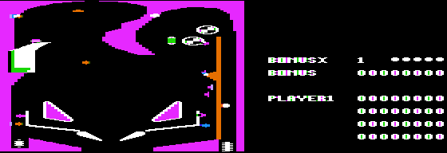
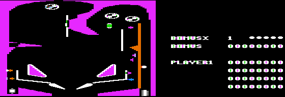
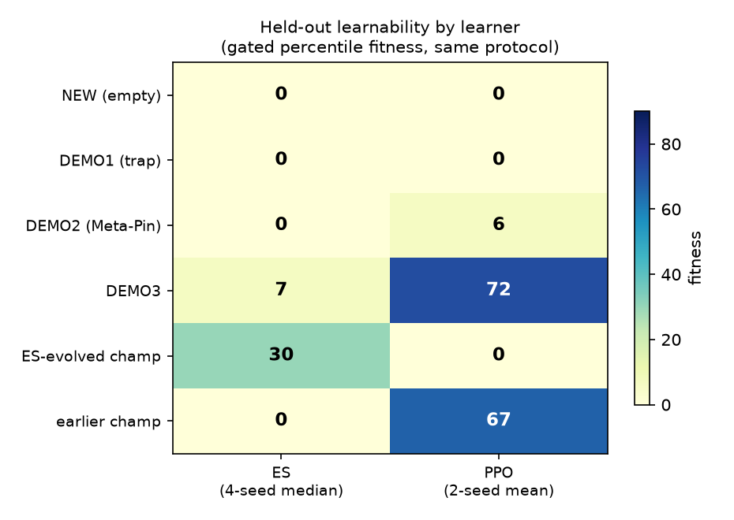

# Evolving boards: smoke run, lineage, and learned policies

First end-to-end run of the full automatic-game-design loop
(`tools/evolve.py`): (mu+lambda) over board genomes, here with the
**cheap** (random-play score) fitness as a mechanism test. mu=2, lam=3,
4 generations, seed 0.

## The loop works

Best fitness climbed 4.83 -> 6.75 over 4 generations; the population
discovered and propagated a high-scoring board. Generation, mutation,
selection, and improvement all function.

## A clean lineage

Record-set overlap (each board is a strict superset of its parent)
reconstructs the champion's ancestry:

```
g000_i0  (31 recs, random score ~130)
   -> g001_o2  (32 recs, ~172)
      -> g002_o0  (37 recs, ~102,780)   <- the jump: +5 parts
         -> g003_o0  (38 recs)
            -> g004_o1 (37 recs, ~103,585)  champion
```

The decisive event is `g002_o0`: a single mutation added five library
parts that formed a **scoring hotspot** — a bumper cluster the ball
falls into and racks up points in passively. Random-play score jumped
from ~172 to ~103k in one step.

## What the cheap fitness selected for — and why it matters

This is the cautionary result the 2008 paper predicts. The cheap
score-fitness rewarded raw points, so it evolved straight to a
**trivial** board: one where *random play already scores ~100k* because
the hotspot scores without skill. That is exactly the kind of board the
**learnability** fitness is designed to reject (high random baseline =>
low percentile gap => low learnability). The smoke run thus doubles as
a demonstration of why learnability fitness is the right objective:
score-fitness finds passive jackpots, not games.

## How the learned policies work

Policies are 7-feature linear softmax controllers
(phi = [1, x, y, dx, dy, x*dx, y*dy], all normalised) trained by the
same (1+lambda)-ES used in the estimator. The most legible summary is
the **action map**: the greedy action as a function of ball position
for a downward-moving ball.

- **g000_i0 (the learnable ancestor).** Trained policy scores **1817 vs
  ~130 random — a 14x improvement**, real skill differentiation. The
  action map shows a height-based rule: **hold the left flipper while
  the ball is high, switch to the right flipper as it descends into the
  flipper zone**, and never leave both idle. The switch boundary slopes
  (higher on the right), so the policy anticipates which flipper the
  ball is heading for. This is genuine positional control.

- **g002_o0 / g004_o1 (the trivial hotspot boards).** A direct probe —
  median score over 8 balls under three controllers — shows the points
  are **policy-independent**:

  | board | flippers idle | random | trained |
  |---|---|---|---|
  | g000_i0 (ancestor) | 120 | 94 | (needs longer episodes — see below) |
  | g002_o0 (hotspot) | 17,225 | 17,120 | 17,075 |
  | g004_o1 (champion) | 17,365 | 17,250 | 17,220 |

  (50-step episodes; absolute numbers scale with episode length, the
  ratios are the point.) On the hotspot boards idle ≈ random ≈ trained
  to within 1%: the ball falls into the bumper cluster and scores with
  the flippers switched **off**. Skill is irrelevant. Training a policy
  there is also prohibitively slow precisely because the ball survives
  passively in the hotspot for the whole episode — the cost *is* the
  triviality.

The contrast is the learnability story in one lineage: on the ancestor a
trained policy reaches ~1817 vs ~130 random at the full training budget
(**~14x**, real skill), while on the evolved champion the controller
makes no difference at all. That is exactly the failure mode the
learnability fitness is built to avoid, and the argument for swapping
the outer fitness from `cheap` to `learnability` for the real
experiment.

(Aside: at the very short 50-step budget even the ancestor scores little
under any policy — its scoring needs longer play to express, so
learnability there is budget-dependent. The hotspot triviality, by
contrast, holds at every budget.)

Artifacts: `tools/train_policy.py` (train + action map),
`tools/analyze_policies.py` (combined figure + weight tables),
`harness/replay.lua` + `tools/record_replay.py` (gameplay video).
Boards and per-board metrics are in `work/evo_smoke/`.

---

# The learnability experiment

The headline run: the same (mu+lambda) loop, now with **learnability
fitness** instead of cheap score fitness. This is the Togelius &
Schmidhuber 2008 idea proper — evolve boards a random player does poorly
on but a learner can improve on.

Setup: mu=3, lam=4, 6 generations, seed 0. Fitness =
percentile-of-random x magnitude ramp (see below), ~31 board
evaluations, `work/evo_learn/` (full log committed under
`docs/champions/learnability_run_log.jsonl`).

## A metric flaw, caught mid-run

The first attempt used the raw percentile (learned score's rank within
the board's random-play distribution), the metric validated in the
replication study. It has a hole: a **tight-variance trivial board**
fools it. One evolved board scored the 95th percentile while the learned
policy beat random by 1.6 points (learned 1085 vs random 1083) — every
random episode scored ~1083, so a marginally higher learned score still
"beat" 95% of them. The replication study missed this because its
trivial boards (passive hotspots) had *high*-variance random scores, so
learned ≈ random landed at the 50th percentile.

Fix: multiply the percentile by a **magnitude ramp** that scales 0->1 as
the learned policy beats the random *median* by max(150 pts, the median
itself). Validated against the flawed run's logged data: the trivial
board dropped 95 -> 0.1; every genuinely learnable board (random low,
learned high) was unchanged. The run was restarted with the corrected
metric.

## Result



- **The search stays in the learnable region.** Every surviving board
  sits at the 80-100th percentile with a real learned-vs-random gap;
  26 of 31 evaluated boards were learnable.
- **Trivial, dead, and random-beats-learned boards are pinned at 0** and
  excluded from breeding — concentrated in the early random generations
  and bred out (gens 4-6 have far fewer zeros).
- **Best fitness:** held at 93.3 for five generations (percentile
  saturation makes the top gentle), then climbed to **100.0** in
  generation 6 (`g006_o1`): a board where the trained policy beats
  *every* random episode.
- The champions are textbook learnable boards: `g006_o1` (learned 4936
  vs **random median 26**), `g002_o0` (1675 vs 33), `g000_i3` (6218 vs
  452). On all of them a random player essentially fails and a learner
  succeeds.

## Cheap vs learnability: same shape, opposite games

| | cheap-fitness champion (`g002_o0`, evo_smoke) | learnability champion (`g006_o1`, evo_learn) |
|---|---|---|
| random play | **~103,000** (passive jackpot) | **median 26** (random fails) |
| trained play | ~same as random (skill irrelevant) | ~4936 (skill required) |
| what it is | a board that plays *itself* | a board you must *learn* |




The two champions look alike — chassis plus scattered parts — but they
are opposite games. Score fitness found a passive bumper cluster that
racks up 100k with the flippers switched off; learnability fitness found
a board where the points are only reachable with flipper skill. That is
the whole thesis of the 2008 paper, reproduced end to end in a 1983
game running in emulation: *learning progress, not score, is what
selects for a game rather than a toy.*

## Caveats / next steps

- The percentile saturates near the top, so selection pressure among
  good learnable boards is gentle (hence the long 93.3 plateau). A
  magnitude-forward metric (e.g. log learned/random gap) would sharpen
  top-end differentiation.
- Single seed, short run (6 generations). Multi-seed runs and a longer
  horizon would establish whether learnability keeps climbing or plateaus.
- A cheap pre-screen for unscoreable bouncy boards would cut the ~15 min
  spent rejecting each dead board in the random initial population.

---

# Addendum: held-out re-evaluation — the third Goodhart, caught

Post-hoc validation of the learnability champion (fresh container,
rebuilt environment) surfaced a third — and deepest — case of the outer
loop exploiting its measuring instrument.

**Finding.** Re-running the estimator on champion `g006_o1` reproduces
high fitness on every fresh seed (86.7 / 100.0 / 96.7 at 2x budget).
But deploying the *trained policy itself* on held-out episodes does
**not** beat random play (softmax median 61 vs random 95 over fresh
14-episode sets). The reason: the estimator's "learned" statistic
(`final3`) scores the *selected* candidate on the *same* episodes used
to select it — a max over noisy means, systematically inflated on any
board where policy perturbations can occasionally catch a lucky
high-scoring trajectory. Re-running the estimator replicates the bias,
not the skill. The outer loop had partly evolved boards that *game the
estimator's selection noise*.

**Control.** The same held-out test on DEMO2 (Meta-Pin, human-designed)
**does** show genuine deployable learning: trained softmax median 50 vs
random median 3 (~17x), mean 1339 vs 444, on fresh episodes. So the
inner learner does acquire real skill where real skill exists; the flaw
was in what the fitness *measured*, not in the learning machinery.

**Fix (implemented).** `calibrate_board` now ends with a held-out phase:
the final parent policy is evaluated on fresh episodes, and
`eval_learnability` computes fitness from the **held-out median** rather
than `final3`. Deployment-verifiable skill is now the selection target.

**The three-Goodhart arc** — each fitness was exploited by evolution and
each exploit forced a principled fix:

| # | fitness | exploit evolved | fix |
|---|---|---|---|
| 1 | raw score | passive jackpot boards (random scores 103k) | learnability fitness |
| 2 | percentile-of-random | tight-variance boards (learned 1085 vs random 1083 = "95th pct") | magnitude gate |
| 3 | selection-biased learned estimate | boards where ES selection catches lucky trajectories without robust skill | held-out evaluation |

This arms race between the optimiser and its measuring instrument is
arguably the most interesting result of the project so far: even a
7-board-per-generation evolutionary loop reliably finds and exploits
every gap between "what we measure" and "what we mean". The next
experiment — evolution against the held-out fitness — tests whether
deployment-verified learnability is finally un-gameable at this scale.

(Deployment note also folded into the tooling: greedy argmax deployment
of a softmax-trained policy can collapse to a degenerate action loop —
policies must be deployed with the same stochasticity they were trained
under. `harness/replay.lua` now supports `PCS_TEMP=1`; `train_policy.py`
returns the robust final parent rather than the noisy-max candidate.)

---

# The held-out evolution run and the ES-vs-PPO comparison

## Held-out multi-seed evolution (the redemption run)

Same (mu+lambda) loop, fitness = **median over 4 independent inner
learning runs** of the held-out gated percentile (tools/evolve.py).
Trajectory: initial random population mostly fails honest learnability
(best 25.5, bimodal seeds), then **25.5 -> 60.0 -> 70.0** in two
generations, holding to the end. In-run champion `g002_o0` had all four
inner seeds positive (held-out medians 631/988/251/641 vs random
249/249/44/249). 31 boards: 12 learnable, 3 trivial-gated, 15
unlearnable, 1 dead. Log: `docs/champions/holdout_run_log.jsonl`.

**Residual bias, measured:** re-evaluating the champion with *fresh*
inner seeds gives 30.0 (seeds [0, 60, 0, 73]) rather than the in-run
70.0 — the outer loop had partly adapted to the four specific inner
seeds used for every evaluation during the run (fitness reproducibility
came at the cost of seed-overfitting). Still clearly the most
ES-learnable evolved artifact, but future runs should draw fresh inner
seeds per evaluation and accept noisier fitness. The Goodhart ledger
thus gains a fourth, milder entry: fixed evaluation seeds.

## Learner x board matrix (all held-out, same protocol)



| board | ES (4-seed median) | PPO (2-seed mean) |
|---|---|---|
| NEW (empty) | 0 | 0 |
| DEMO1 (trap) | 0 | 0 |
| DEMO2 (Meta-Pin) | 0* | 6 |
| DEMO3 | 7 | **72** |
| **ES-evolved champion** | **30** | 0 |
| earlier (biased-run) champion | 0 | **67** |

*DEMO2 under ES is budget-sensitive: at the evolve-loop inner budget it
learns ~1 seed in 4 (median 0); a single full-budget run showed a clean
17x held-out gap. PPO's DEMO2 weakness (6) is consistent across seeds.

**Findings:**

1. **Double dissociation on the evolved champions, replicated across
   seeds.** The ES-evolution champion is learnable by ES (30; two seeds
   at 60-73) and opaque to PPO (0, both seeds). The earlier champion —
   which failed ES held-out verification and was provisionally written
   off as estimator-noise gaming — is *genuinely learnable by PPO*
   (73/60 across seeds, held-out). Each evolutionary run produced boards
   matched to the inductive biases of the learner inside its fitness.
   That partially rehabilitates the earlier champion: not a noise
   artifact, but a board whose skill lies outside a 28-parameter linear
   policy's reliable reach and inside an MLP's.
2. **Near-orthogonal learner profiles on the human boards too**: PPO
   dominates DEMO3 (72 vs 7); ES (at full budget) dominates DEMO2.
   "Learnable" is not a property of a board alone but of a
   board-learner pair — the learner-relativity question from the 2008
   paper, now with quantitative, deployment-verified instances,
   including *evolved* artifacts that sit on opposite sides of the
   dissociation.
3. Degenerate boards are 0 for both learners — the gates are
   learner-independent, as they should be.

The natural headline experiment this sets up: evolve with fitness =
min(ES, PPO) for boards learnable by *both* (robust game quality), or
fitness = |ES - PPO| for maximal learner differentiation (the 2008
paper's closing proposal, now directly implementable).

## Queued ideas (from discussion, 2026-08-06)

Two directions raised after the ES-vs-PPO comparison, deliberately
queued behind the dual-learner run:

1. **More learners / more policy representations.** With the held-out
   gated-percentile protocol now learner-agnostic (the same formula
   wraps ES and PPO), adding learners is cheap: an MLP trained by ES
   (separates representation from optimizer — our current 2x2 confounds
   them: linear+ES vs MLP+PPO), tile-coding/tabular Q-learning, CMA-ES
   on the linear policy, different MLP widths/depths, or an *evolvable*
   policy representation (e.g. neuroevolution with topology growth).
   The learner-matrix experiment generalizes to an N-learner profile
   per board; boards become points in "learnability space" and
   evolution can target any region of it. The linear-vs-MLP confound is
   the first thing to resolve: run ES-MLP on the four matrix boards.

2. **Discrete-improvements fitness (strategy-ladder depth).** Lantz et
   al., "Depth in Strategic Games" (AAAI-17 workshops): depth d = the
   number of discrete step-unit improvements in best-strategy strength
   as computational resources increase, from random-play CR to
   perfect-play CR. Our inner loop is almost exactly a partial,
   low-CR-regime instantiation: training compute is the resource axis,
   and the ES already logs a per-generation curve. What is missing for
   an honest step count is *held-out checkpoints*: curve_raw is
   selection-biased (each point is a max over noisy candidate means),
   so steps counted on it would partly count selection noise. Plan:
   checkpoint the parent policy every k inner generations, evaluate
   each checkpoint on fresh episodes at the end, count steps of >= 1
   noise-calibrated unit (e.g. exceeding the previous plateau by more
   than a bootstrap CI width), fitness = number of steps. This directly
   selects for *staircase-shaped* learning curves — boards with
   multiple skill plateaus — rather than any-gain boards, and is
   robust to the magnitude-of-gain Goodharting that forced the ramp
   gate: many small honest steps beat one lucky jackpot. Risks to
   pre-register: step-counting is noise-sensitive (needs the CI-based
   step unit, not a fixed threshold); and a learner with a fixed budget
   caps the observable step count, so the measurable range of d is
   narrow (~0-4 steps at our budgets) until budgets grow.

## Experiment: dual-learner evolution, fitness = min(ES, PPO)

The single-learner runs each produced boards matched to their learner's
inductive biases (the double dissociation above). The obvious fix is to
require *both* learners to learn the board: fitness = min(ES fitness,
PPO fitness), both measured by the identical held-out gated-percentile
protocol. A board can no longer win by exploiting one learner's quirks;
it has to contain skill that is discoverable by two very different
optimizers (a 28-parameter linear softmax under a (1+4)-ES, and a
[32,32] MLP under PPO). min() is also the conservative aggregator: it
optimizes the worst case, which is the right notion of "robustly
learnable".

Protocol changes vs the previous run:

- **Fresh inner seeds per evaluation** (fix for Goodhart #4): every
  evaluation draws its inner seed base from the outer rng, so no board
  can adapt to a fixed serve set. Fitness is noisier; the multi-seed
  median and the min() both push in the conservative direction.
- **ES-first short-circuit**: ES (2 seeds, ~8 min) runs first; if the
  ES median is 0, min() is 0 regardless of PPO, so PPO (2 seeds x 30k
  steps, ~25-30 min) only runs on boards that pass the ES gate. This
  makes the run affordable: unlearnable offspring cost ~8 min, and the
  full dual price is paid only for candidates.
- Also implemented: `--fitness dual_diff` = |ES - PPO| (the 2008
  paper's learner-differentiation proposal) for a follow-up run.

Run: `python3 tools/evolve.py --out work/evo_dual --fitness dual
--gens 10 --mu 3 --lam 6 --seed 0` (results section to follow).
