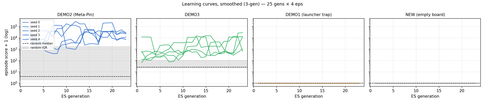
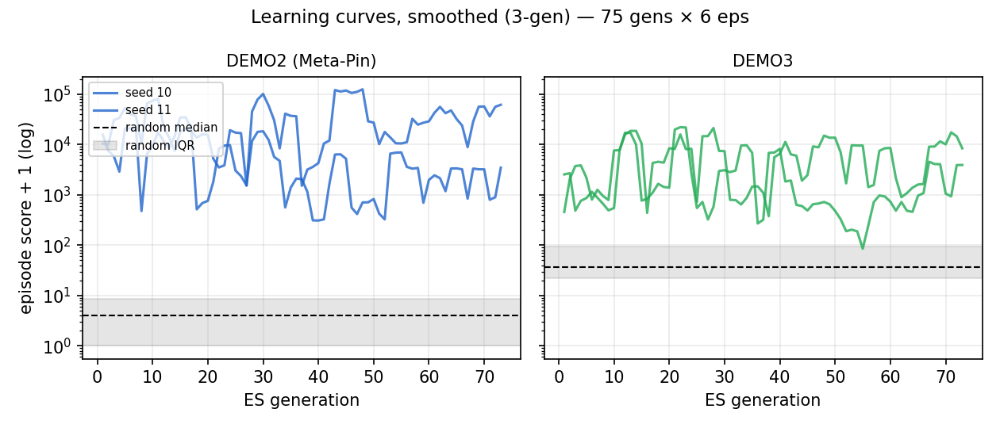
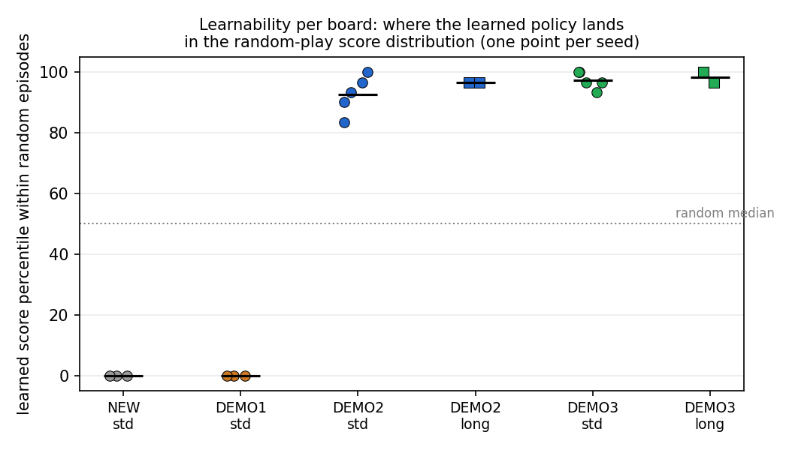

# The PCS reinforcement-learning environment

`tools/pcs_env.py` exposes PCS pinball boards as a Gym-style environment
for the learnability-as-fitness experiments (cf. Togelius & Schmidhuber
2008: a board is promising if a learning agent improves on it, while a
random player does poorly and the board is neither trivial nor hopeless).

## Architecture

```
PCSPinballEnv (Python)
   │  file IPC on /dev/shm (this MAME build has no sockets)
harness/bridge.lua in headless MAME (apple2p, PCS disk)
   │  save-state restore per episode
work/states/<board-hash>.sta   (made once by harness/make_state.lua)
```

- **Save states make episodes cheap.** `make_state.lua` drives the real
  UI once per board (~2 s wall at unthrottled speed) and saves the
  machine at the player-select screen, *after* the engine has baked the
  board into its collision tables. Every `reset()` restores that state
  instead of re-booting: episodes cost **0.2–1.6 s wall** instead of two
  minutes. States are cached in `work/states/` keyed by board content
  hash.
- **Zero idle frames.** While waiting for the next command the bridge
  blocks inside MAME's frame callback, so the emulator does not advance
  between steps. Result: a fixed plunger strength + action sequence
  reproduces a trajectory **bit-exactly** (verified). All episode
  stochasticity comes from the plunger draw in `reset()` — exactly the
  controlled noise we want against trajectory memorisation.

## Episode semantics

- `reset(plunger=None)`: restore state → tap through player select
  (game start detected as *ball motion*, since the source's ball
  counter doesn't exist in the shipped binary) → wait for the ball to
  settle on the spring (that resting point becomes the **drain
  anchor**) → pull the plunger. If the ball falls back without leaving
  the lane, re-plunge stronger, up to 5 attempts; persistent failure
  marks the board **launch-degenerate** and the first `step()` returns
  `done` with `info["dead"]=True`. (DEMO1, whose ball wedges in the
  lane, is caught by exactly this — the degenerate-board pre-filter
  costs nothing.)
- `step(action)`: action ∈ {0 none, 1 left, 2 right, 3 both flippers},
  held for `PCS_SKIP` frames (default 10 ≈ 6 actions/s). With gating
  enabled, the bridge then auto-runs no-op frames while the ball is
  above `PCS_ACT_Y` (default y<100, away from the flippers), capped at
  `PCS_SKIP_CAP` frames, so the policy is only consulted when its
  actions can matter.
- **Drain detection** is geometric: the ball has *entered play* once it
  leaves the lane column (|x−anchor| > 12); a drain is the ball
  reappearing in the lane bottom (|x−anchor| ≤ 2, y ≥ anchor−10), which
  is the engine re-serving the next ball. The x-gate keeps outlane
  passes from false-positiving.
- Observation `[x, y, dx, dy]` from zero page ($D2–$D7); reward = delta
  of the engine's own score (digit array at $8952).

## Measured behavior (Meta-Pin / DEMO2, random policy)

Episode lengths 15–172 steps, scores 0–36k, all ending in the
reserve-fall signature; ~0.5 s wall per episode typical. That is roughly
**100–200 episodes/minute per MAME instance**, before parallelism.

## Debug commands

The bridge also answers `peek <addr>` (read a byte) and `anchor`
(current drain anchor + in-play flag) — useful for probing the shipped
binary, whose memory layout differs from the released source in places
(no `$82` ball counter; score at `$8952`).

## Known limits / next steps

- Parallel instances need per-instance `-cfg_directory` (the shared
  `work/cfg` will race); add when wiring the vectorized env for PPO.
- The action space omits the plunger (env-controlled at reset) and
  nudge/tilt. Revisit if learnability experiments suggest the policy
  needs serve control.
- Reward is raw score delta; the learnability fitness should normalize
  per board against the random-policy distribution (see the discussion
  in the project notes — score values are part of the genotype and
  trivially inflatable).

## Replication study (20 runs, multi-seed + long budgets)

Estimator fitness now adds two deliberately minor exploration terms next
to score and survival: distinct 16px playfield cells visited and
distinct cells where scoring occurred ("different items touched"),
weights 0.2 each. Replication matrix: 25 gens x 4 episodes at seeds 0-4
(playable boards) / 0-2 (degenerate boards), plus 75 gens x 6 episodes
("long", seeds 10-11) on the playable boards. `tools/replicate.py`;
robust analysis in `tools/analyze_replication.py`; figures in
`docs/figures/` via `tools/plot_replication.py`.

**Headline metric — percentile of learned performance within the
random-episode score distribution** (LP_z's mean/std normalisation is
unusable here: pinball score tails are so heavy that one unattended
~500k jackpot random episode crushes a genuinely learning run to
LP_z=0, and near-zero baselines explode it to +251):

| Board | Budget | n | Percentile (mean ± std) |
|---|---|---|---|
| NEW (empty) | std | 3 | 0.0 ± 0.0 |
| DEMO1 (lane trap) | std | 3 | 0.0 ± 0.0 |
| DEMO2 (Meta-Pin) | std | 5 | **92.7 ± 5.7** |
| DEMO2 | long | 2 | **96.7 ± 0.0** |
| DEMO3 | std | 5 | **97.3 ± 2.5** |
| DEMO3 | long | 2 | **98.3 ± 1.7** |

Conclusions: (1) the first-pass result was not luck — every seed on
both playable boards learns to >=83rd percentile of random play, and
all degenerate runs pin at zero; (2) more budget tightens the estimate
(long runs: 96.7-98.3 with std <=1.7); (3) DEMO3, which looked
unlearnable in the score-only first pass, learns on every seed once the
exploration terms give the ES gradient — estimator shaping mattered
more than budget; (4) the learning curves (figures) rise 2-3 orders of
magnitude above the random IQR and stay there.





## Calibration results (first pass, seed 0)

Estimator: (1+4)-ES over a 7-feature linear softmax policy, 25
generations × 4 episodes/candidate, common-random-number serves,
replace-on-margin; ES fitness = mean log(1+score) + 0.5·log(1+frames)
(the survival term is what made learning visible — score alone is too
heavy-tailed at this episode budget). `tools/learn_es.py`, ~2–4 min per
board with 6 parallel envs.

| Board | Random (mean ± std) | Learned (final 3 gens) | LP_z |
|---|---|---|---|
| NEW (empty) | 0 ± 0 | 0 | **0.00** ✓ correctly hopeless |
| DEMO1 (lane trap) | 0 ± 0 | 0 | **0.00** ✓ correctly degenerate |
| DEMO2 (Meta-Pin) | 2303 ± 5053 | 22260 | **+3.95** ✓ clear learning |
| DEMO3 | 2294 ± 9420 | 97 | −0.23 — no learning at this budget |

DEMO2 is the existence proof: learning progress separates a rich
playable board from degenerate ones by ~4 baseline-stddevs. DEMO3 is the
honest open question — either it genuinely affords the player less
control, or the estimator's budget/learner is too weak for it; this is
the learner-relativity issue inherent to learnability fitness and worth
keeping as a calibration probe. Earlier passes that used score-only
fitness with 2 episodes/candidate showed *no* learning even on DEMO2 —
estimator design matters more than raw budget.

Engineering notes from the calibration runs: the bridge idle watchdog
must be long (600 s) because a thread-pool's LIFO env reuse can starve
an instance for minutes; dead boards short-circuit after 3 degenerate
resets so the empty board costs 3 s, not 2 minutes.
